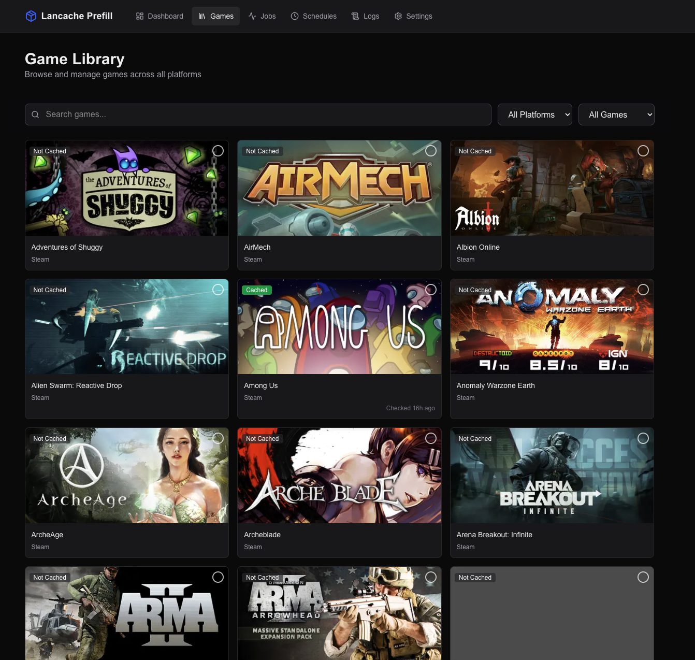
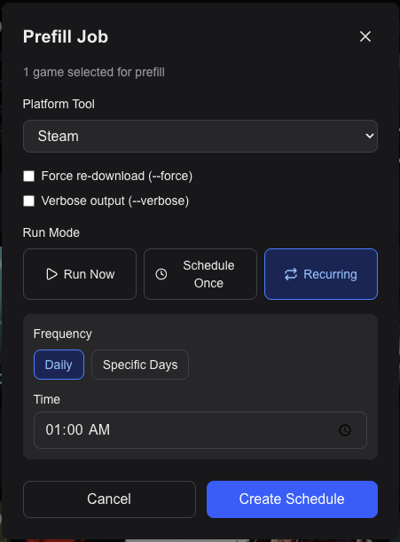
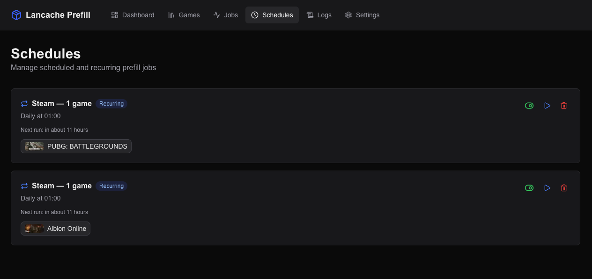
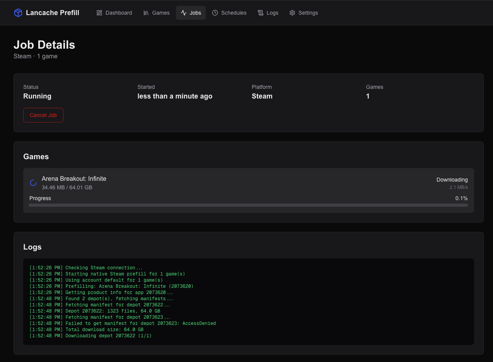
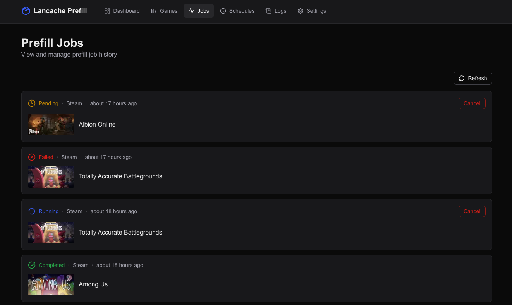

# Lancache Prefill UI

Web UI for managing [lancache](https://lancache.net/) prefill operations across Steam, Battle.net, and Epic Games. Pre-download game content through your lancache server so LAN clients get maximum download speeds.

Built on top of the excellent prefill tools by [tpill90](https://github.com/tpill90):
- [SteamPrefill](https://github.com/tpill90/steam-lancache-prefill)
- [BattleNetPrefill](https://github.com/tpill90/battlenet-lancache-prefill)
- [EpicPrefill](https://github.com/tpill90/epic-lancache-prefill)

## Features

- **Native Steam Integration** — logs in directly via the Steam network (no CLI tool needed), with multi-account support
- **Battle.net & Epic Games** — wraps the CLI prefill tools as managed subprocesses
- **Multi-Account Support** — log in with multiple Steam accounts and see a unified game library; the correct account is automatically selected for each prefill
- **Game Library Browser** — browse your game library with Steam header images, search/filter, and bulk select for prefill
- **Real-Time Progress** — live download progress via Server-Sent Events (SSE)
- **Cache Statistics** — view lancache cache size and per-game cache status (local directory scan or remote via SSH)
- **Job History** — track all prefill jobs with detailed logs
- **Dark Mode** — automatic dark/light theme based on system preference

## Screenshots

### Dashboard
Overview with cache stats, recent jobs, upcoming schedules, and connection status.


### Game Library
Browse, search, and filter your game library. Select games for prefill or scheduling.



### Prefill Dialog
Run prefills immediately, schedule them for a specific time, or set up recurring schedules.



### Schedules
Manage one-time and recurring prefill schedules with enable/disable and run-now controls.



### Job Details
Real-time download progress with per-game status, speed, and detailed logs.



### Jobs List
Track all prefill jobs with game thumbnails, status indicators, and schedule badges.



### Settings
Configure connection mode, scheduling defaults, auto-update, and manage prefill tools.


## Quick Start with Docker

### Docker Run

```bash
docker run -d \
  --name lancache-prefill-ui \
  -p 3000:3000 \
  -v lancache-prefill-data:/app/data \
  ghcr.io/nickantoniadis/lancache-prefill-ui:latest
```

Then open [http://localhost:3000](http://localhost:3000).

### Docker Compose

```yaml
services:
  lancache-prefill-ui:
    image: ghcr.io/nickantoniadis/lancache-prefill-ui:latest
    container_name: lancache-prefill-ui
    restart: unless-stopped
    ports:
      - "3000:3000"
    volumes:
      # Persistent database
      - lancache-prefill-data:/app/data
      # Optional: mount lancache cache directory for local cache stats
      # - /path/to/lancache/cache:/data/cache:ro
    environment:
      - DATABASE_URL=file:./data/lancache-prefill.db
      - LANCACHE_PATH=/data/cache/

volumes:
  lancache-prefill-data:
```

A ready-to-use `docker-compose.yml` is included in the repository.

### Optional Volume Mounts

| Mount | Purpose |
|---|---|
| `/app/data` | **Required.** Persistent storage for the SQLite database |
| `/data/cache` (read-only) | Mount your lancache cache directory for local cache size stats |

### Environment Variables

| Variable | Default | Description |
|---|---|---|
| `DATABASE_URL` | `file:./data/lancache-prefill.db` | SQLite database path |
| `LANCACHE_PATH` | `/data/cache/` | Cache path inside the container (must match the mount) |

## Unraid Installation

An Unraid Community Applications template is included at `unraid/lancache-prefill-ui.xml`.

1. In Unraid, go to **Docker** > **Add Container** > **Template** > paste the template URL:
   ```
   https://raw.githubusercontent.com/nickantoniadis/lancache-prefill-ui/main/unraid/lancache-prefill-ui.xml
   ```
2. Configure the ports and paths:
   - **Web UI Port**: `3000` (default)
   - **Database**: `/mnt/user/appdata/lancache-prefill-ui` (persistent storage)
   - **Lancache Cache Directory** (optional): `/mnt/user/lancache/cache` for local cache stats
3. Click **Apply**

## Build from Source

### Prerequisites

- Node.js 22+
- npm

### Setup

```bash
# Clone the repository
git clone https://github.com/nickantoniadis/lancache-prefill-ui.git
cd lancache-prefill-ui

# Install dependencies
npm install

# Generate Prisma client
npx prisma generate

# Run database migrations
npx prisma migrate dev

# Seed the database with default tools and settings
npm run db:seed

# Start the development server
npm run dev
```

Open [http://localhost:3000](http://localhost:3000).

### Build Docker Image Locally

```bash
docker build -t lancache-prefill-ui .
docker run -d -p 3000:3000 -v lancache-prefill-data:/app/data lancache-prefill-ui
```

## Configuration

### Steam Setup (Native)

Steam uses a native integration that connects directly to the Steam network — no CLI tool is required.

1. Go to **Settings** in the web UI
2. Under **Steam**, click **Add Steam Account**
3. Enter your Steam username and password
4. Complete the Steam Guard verification if prompted
5. Repeat for additional accounts — games from all accounts appear in a unified library

### Battle.net Setup

Battle.net prefill uses the [BattleNetPrefill](https://github.com/tpill90/battlenet-lancache-prefill) CLI tool.

1. Download BattleNetPrefill from the [releases page](https://github.com/tpill90/battlenet-lancache-prefill/releases)
2. Make it executable: `chmod +x BattleNetPrefill`
3. Run the initial authentication: `./BattleNetPrefill select-apps` and follow the prompts
4. In the web UI, go to **Settings** and set the path to the BattleNetPrefill binary
5. Click **Sync Games** to import your Battle.net library

### Epic Games Setup

Epic Games prefill uses the [EpicPrefill](https://github.com/tpill90/epic-lancache-prefill) CLI tool.

1. Download EpicPrefill from the [releases page](https://github.com/tpill90/epic-lancache-prefill/releases)
2. Make it executable: `chmod +x EpicPrefill`
3. Run the initial authentication: `./EpicPrefill select-apps` and follow the prompts
4. In the web UI, go to **Settings** and set the path to the EpicPrefill binary
5. Click **Sync Games** to import your Epic Games library

### Cache Statistics

Cache stats can be gathered in two ways:

- **Local mount**: Mount your lancache cache directory to `/data/cache:ro` in the container
- **Remote SSH**: Configure SSH connection details in **Settings** to query cache size on a remote lancache server

### DNS Requirements

For lancache to work, your network's DNS must resolve game CDN domains to your lancache server's IP. See the [lancache.net documentation](https://lancache.net/) for DNS setup instructions.

## Tech Stack

- [Next.js 16](https://nextjs.org/) (App Router)
- [React 19](https://react.dev/)
- [TypeScript 5](https://www.typescriptlang.org/)
- [Tailwind CSS 4](https://tailwindcss.com/)
- [Prisma 7](https://www.prisma.io/) + SQLite
- [steam-user](https://www.npmjs.com/package/steam-user) (native Steam integration)
- [Lucide React](https://lucide.dev/) (icons)

## Credits

- [tpill90/steam-lancache-prefill](https://github.com/tpill90/steam-lancache-prefill) — Steam prefill CLI tool
- [tpill90/battlenet-lancache-prefill](https://github.com/tpill90/battlenet-lancache-prefill) — Battle.net prefill CLI tool
- [tpill90/epic-lancache-prefill](https://github.com/tpill90/epic-lancache-prefill) — Epic Games prefill CLI tool
- [lancache.net](https://lancache.net/) — The lancache project

## License

MIT
